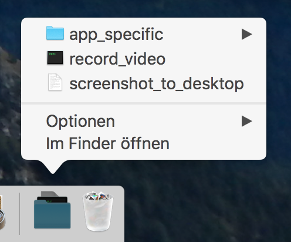

# Android Scripts

A collection of useful scripts for developing, testing and exploring Android apps. They make tasks like getting a screenshot or video from your Android device as quick as clicking a button.

When describing a rare bug, a picture or video is worth a thousand words. The same goes for presenting your application to an audience.

### Prerequisites

You need to have an Android Development Environment set up before using the scripts. Specifically, the adb command has to be available on your PATH.

### Install

If you haven't done so already, head over to the [Android Studio Website](https://developer.android.com/studio/index.html) and install the SDK as described.

You should keep the script folder in a place that is easily accessible. I like to keep it in the dock of my Mac:



## Use

If you have everything set up as described, you just need to click (or double-click) on a script to make it run. If you want to set up a specific app, use the scripts in scripts/app_specific folder. Create a copy of the folder with the package name of your application:

```
cp -r app_specific/ com.your.application
```

The app specific scripts will use the last folder name as package name of the application.

## Author

* **Ulrich Scheller** - *Initial work* - [Website](https://www.ulrich-scheller.de/)
